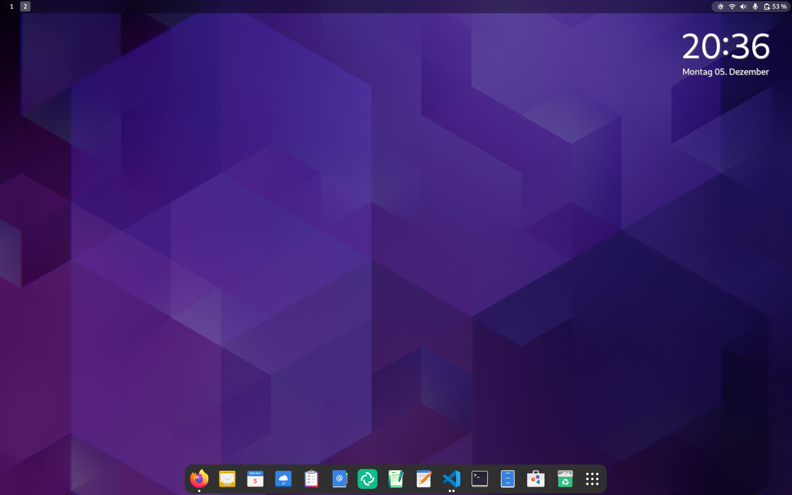

<!--
reference: https://www.makeareadme.com/
reference: https://commonmark.org/
-->

[](https://cirrus-ci.com/github/dschier-wtd/fedora-workstation)
[](https://github.com/dschier-wtd/fedora-workstation/releases)
[](https://github.com/dschier-wtd/fedora-workstation/issues)
[](https://github.com/dschier-wtd/fedora-workstation/pulls)
[](https://github.com/dschier-wtd/fedora-workstation/blob/main/LICENSE)

# Fedora Workstation

Ansible setup of my workstation.

## Motivation

I am using Fedora Silverblue for my workstation. I have some customizations
applied and software installed, that I rely on. To ensure that everything works
after a re-installation and to document my setup, I want to use Ansible.

## Description

The Ansible playbook will install and configure various software. Most of the
automation can be configured very easily and should be self-explanatory.
Nevertheless, the following section will provide a feature overview.

I also wrote an article in my
[blog](https://blog.while-true-do.io/fedora-my-workstation-setup) about this
setup.

### Screenshots

Just some impressions.



### Features

The below software and configurations are examples for the included software. I
am heavily relying on Flatpaks from [Flathub](https://flathub.org) and some
binary downloads.

- Firefox
- GNOME Calendar
- GNOME Clocks
- Geary
- Endeavor (formerly GNOME ToDo)
- Totem video player
- GIMP
- kubectl
- kubectx
- kubens
- Skaffold
- cirrus-cli
- ngrok
- micro
- VSCode

And many more.

### Support

The repository is meant for my own set of hardware and the hardware is mostly
working out of the box, without additional drivers or tooling. Therefore, it
may work for your setup, too. Nevetherless, there is no guarentee, though.

My setup consists of:

- [Fedora Silverblue](https://silverblue.fedoraproject.org/)
- [Dell XPS 13 9315](https://en.wikipedia.org/wiki/Dell_XPS)
- [Logitech MX Master](https://www.logitech.com/en-us/mx/master-series.html)
- [Custom Keyboard](https://blog.while-true-do.io/diy-my-first-custom-keyboard/)
- [Dell USB-C Monitor](https://www.dell.com/en-us/work/lp/usb-c-monitor)

This combination has decent battery life, works like a charm with hotplugging
and I am getting firmware updates via GNOME software.

## Usage

The playbook is designed to be used on a localhost via `ansible-playbook` or
`ansible-pull`. This section describes which steps are needed to work with the
same tools, I do.

### Requirements

You will need a Fedora Workstation installation with installed Ansible. I don't
do any partitioning or network configuration in the playbook, so this is up to
you. Nevertheless, for me it works best, when using a simple Fedora Workstation
setup with btrfs. One may say ... "default". :heart:

### Install

This section describes how to install and get the playbook going.

#### Ansible

Before starting to use the playbook, you need to ensure that Ansible is
installed in a recent version.

Since Fedora 36, you can install Ansible Core 2.12/Ansible 5.

```shell
# Install ansible via rpm-ostree
$ sudo rpm-ostree install ansible
```

#### Playbook

Afterwards, you can download the desired release from the
[release page](https://github.com/dschier-wtd/fedora-workstation/tags) and
store it in a location, that suits your needs.

```shell
# Download a tag/release
$ https://github.com/dschier-wtd/fedora-workstation/archive/refs/tags/<tag_name>.zip

```

If you want to use git, help to develop or change to a tag/branch on the fly,
you can clone the repository instead.

```shell
# Clone the repository with a given tag
$ git clone https://github.com/dschier-wtd/fedora-workstation.git

# Checkout the desired tag
$ git checkout <tag_name>
```

#### Roles and Collections

Before running the actual playboook, it is needed to install required roles
and collections. This can be done in two simple commands.

```shell
# Install collections
$ ansible-galaxy collection install -r ansible/requirements.yml

# Install roles
$ ansible-galaxy role install -r ansible/requirements.yml
```

This will also install the upstream collection
[whiletruedoio.desktop](https://github.com/whiletruedoio/whiletruedoio.desktop)
which is maintained by me, too.

#### Tuning variables

You can find a [manifest.yml](./ansible/manifest.yml) in the repository. There
you will find multiple options to configure your desired setup. For now, this
is quite minimal, but you can also check out the `defaults/main.yml` of each
role and change the variables via the `manifest.yml`.

#### The first run

Now you are ready to execute the playbook. Be aware, that this will run for
quite some time, remove packages, download packages and configure a couple of
services.

```shell
# Check run and show diffs
$ ansible-playbook --check --diff -K ansible/playbooks/configure.yml

# Execute the playbook
$ ansible-playbook -K ansible/playbooks/configure.yml
```

It is a good idea to restart your machine afterwards to ensure that everything
is working and configured as expected.

## Contribute

The dotfiles are intended to be used by me (Daniel Schier), but please feel free
to use/fork/enhance them or opening issues to give me an idea what may be added
in future versions.

## License

Except otherwise noted, all work is [licensed](LICENSE) under a
[BSD-3-Clause License](https://opensource.org/licenses/BSD-3-Clause).

## Contact

Please feel free to reach out to me to provide feedback or get in touch.

- Site: <https://while-true-do.io>
- Blog: <https://blog.while-true-do.io>
- Code: <https://github.com/dschier-wtd>
- Mail: [dschier@while-true-do.io](mailto:dschier@while-true-do.io)
